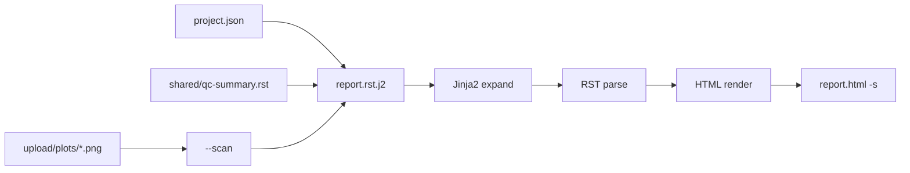

## Bioinformatics Report Tutorial

This tutorial builds a **single-cell RNA-seq analysis report** from scratch.
You will end up with a reusable `report.rst.j2` template, a `project.json`
metadata file, auto-discovered UMAP plots, a shared QC fragment, and a
self-contained HTML file suitable for delivery.

The same pattern works for any pipeline that produces predictable output
directories and per-run JSON metadata.

**Prerequisites:** `@seqyuan/rst-cli` installed globally or via `npx`.

```bash
pnpm add -g @seqyuan/rst-cli
```

Related docs: [CLI Tool](/docs/cli), [Template Engine](/docs/template-engine),
[HTML Rendering](/docs/html-rendering).

### Final Directory Layout

```text
scrna-report/
├── assets/
│   └── seqyuan-logo.png
├── shared/
│   └── qc-summary.rst          # reusable fragment
├── upload/
│   └── plots/
│       ├── KO_Treated_24h_umap.png
│       ├── KO_Treated_48h_umap.png
│       └── WT_Control_umap.png
├── project.json                # per-run metadata from pipeline
└── report.rst.j2               # report skeleton (version-controlled)
```

Create the directory and add placeholder images (any PNG will do for testing):

```bash
mkdir -p scrna-report/{assets,shared,upload/plots}
touch scrna-report/upload/plots/{WT_Control,KO_Treated_24h,KO_Treated_48h}_umap.png
# copy your logo:
cp /path/to/logo.png scrna-report/assets/seqyuan-logo.png
```

### Step 1 — Project Metadata (`project.json`)

Your pipeline (Snakemake, Nextflow, annopi, etc.) writes this file at the
end of the analysis run:

```json
{
  "project_name": "单细胞 RNA-seq 分析报告",
  "project_id": "PRJ-2026-001",
  "analysis_date": "2026-06-05",
  "pipeline_version": "scrna-v2.4.1",
  "species": "Human (GRCh38)",
  "reference": "refdata-gex-GRCh38-2024-A",
  "samples": [
    {
      "name": "WT_Control",
      "fastq_dir": "/data/fastq/WT_Control",
      "cells": 5120,
      "median_genes": 1842,
      "note": "野生型对照组"
    },
    {
      "name": "KO_Treated_24h",
      "fastq_dir": "/data/fastq/KO_Treated_24h",
      "cells": 4891,
      "median_genes": 1765,
      "note": "敲除处理 24 小时"
    },
    {
      "name": "KO_Treated_48h",
      "fastq_dir": "/data/fastq/KO_Treated_48h",
      "cells": 5012,
      "median_genes": 1801,
      "note": "敲除处理 48 小时"
    }
  ],
  "qc_passed": true
}
```

### Step 2 — Shared QC Fragment (`shared/qc-summary.rst`)

Split reusable sections into include fragments:

```rst
质控概览
--------


.. note::

   所有样本均通过默认质控阈值（最低 3000 cells，median genes ≥ 1500）。

.. warning::

   部分样本未通过质控阈值，请检查原始 FASTQ 数据。


.. csv-table:: 样本质控指标
   :header: 样本, Cells, Median Genes, 备注
   :widths: 15, 10, 15, 30


   {{ sample.name }}, {{ sample.cells }}, {{ sample.median_genes }}, {{ sample.note }}

```

This file is valid RST **after** Jinja2 expansion — loops and conditionals
run first, then the RST parser sees a normal `.. csv-table::` directive.

### Step 3 — Report Template (`report.rst.j2`)

```jinja
.. container:: report-header

   .. image:: assets/seqyuan-logo.png
      :width: 140px
      :alt: SeqYuan Logo

   项目编号 {{ project_id }}  ·  分析日期 {{ analysis_date }}  ·  Pipeline {{ pipeline_version }}

{{ project_name }}
========================

项目信息
--------

:物种: {{ species }}
:参考基因组: {{ reference }}
:样本数: {{ samples|length }}

.. include:: shared/qc-summary.rst

样本信息
--------

.. list-table::
   :header-rows: 1
   :widths: 10 20 35 35

   * - 编号
     - 样本名称
     - FASTQ 目录
     - 备注

   * - {{ loop.index }}
     - {{ sample.name }}
     - {{ sample.fastq_dir }}
     - {{ sample.note }}


UMAP 降维图
-----------

共发现 {{ plots|length }} 张 UMAP 图（由 ``--scan`` 自动匹配）。


{{ plot.stem }}
~~~~~~~~~~~~~~~

.. image:: {{ plot.path }}
   :width: 600px
   :alt: {{ plot.stem }}



结论与建议
----------

1. 项目元数据来自 ``project.json``，由分析流程自动生成
2. UMAP 图由 ``--scan plots=upload/plots/*_umap.png`` 自动发现
3. 质控章节来自 ``shared/qc-summary.rst``，可在多个报告模板间复用
4. 使用 ``-s`` 生成独立 HTML，可直接发送给客户
```

### Step 4 — Render the Report

Run from inside `scrna-report/`:

```bash
cd scrna-report

rst-render report.rst.j2 \
  -t \
  -d project.json \
  --scan plots=upload/plots/*_umap.png \
  --expand-includes \
  -v analysis_date=2026-06-06 \
  -o report.html \
  -s
```

| Flag | Purpose |
|------|---------|
| `-t` | Treat input as Jinja2 template before RST parsing |
| `-d project.json` | Load template context from JSON |
| `--scan plots=...` | Glob-match plot files → `plots[]` array in template |
| `--expand-includes` | Resolve `.. include::` relative to template directory |
| `-v analysis_date=...` | Override a JSON field at build time |
| `-s` | Standalone HTML (inline CSS + base64 images) |

Open `report.html` — it should be a single file with no external dependencies.

### How `--scan` Works

`--scan plots=upload/plots/*_umap.png` injects an array named `plots`.
The same data is available at `scans.plots`.

Each matched file:

```ts
{
  path: 'upload/plots/WT_Control_umap.png',   // relative to template dir
  absPath: '/abs/path/to/.../WT_Control_umap.png',
  name: 'WT_Control_umap.png',
  stem: 'WT_Control_umap',                    // filename without extension
  ext: '.png',
  dir: 'upload/plots',
  size: 182734,                               // bytes
}
```

Template loops use `plot.path` for `.. image::` and `plot.stem` for captions.
No hardcoded filenames — add a new sample plot and re-run the same command.

### Step 5 — Integrate into a Pipeline

**Snakemake rule example:**

```python
rule render_report:
    input:
        template="report/report.rst.j2",
        data="report/project.json",
        plots=expand("report/upload/plots/{sample}_umap.png", sample=SAMPLES),
    output:
        html="report/report.html",
    shell:
        """
        rst-render {input.template} -t -d {input.data} \
          --scan plots=upload/plots/*_umap.png \
          --expand-includes \
          -v analysis_date=$(date +%Y-%m-%d) \
          -o {output.html} -s
        """
```

**Node.js post-processing hook:**

```ts
import { execSync } from 'node:child_process'
import { writeFileSync } from 'node:fs'

// pipeline writes project.json, then:
execSync(
  'rst-render report.rst.j2 -t -d project.json ' +
  '--scan plots=upload/plots/*_umap.png --expand-includes -o report.html -s',
  { cwd: 'scrna-report', stdio: 'inherit' },
)
```

**Programmatic (no CLI):**

```ts
import { renderRstTemplate } from '@seqyuan/rst-renderer'
import fs from 'node:fs'
import { globSync } from 'glob'

const template = fs.readFileSync('report.rst.j2', 'utf-8')
const context = JSON.parse(fs.readFileSync('project.json', 'utf-8'))

// Manually build plots array (equivalent to --scan)
const plotPaths = globSync('upload/plots/*_umap.png', { cwd: 'scrna-report' })
context.plots = plotPaths.map((path) => ({
  path,
  stem: path.replace(/\.[^.]+$/, '').split('/').pop()!,
  // ... fill other fields as needed
}))

const html = renderRstTemplate(template, context, {
  includeResolver: { baseDir: 'scrna-report' },
})
fs.writeFileSync('scrna-report/report.html', html)
```

Check `renderRstTemplate` options in the
[Template Engine](/docs/template-engine) docs for the exact API surface.

### Customization Tips

**Company logo** — place PNG/SVG in `assets/` and reference with `.. image::`.
Standalone mode base64-encodes local images automatically.

**Override build-time values** — `-v pipeline_version=scrna-v2.5.0` without
editing `project.json`.

**Multiple scan patterns:**

```bash
rst-render report.rst.j2 -t -d project.json \
  --scan umaps=upload/plots/*_umap.png \
  --scan markers=upload/tables/*_markers.csv \
  -o report.html -s
```

Each `--scan` creates both `umaps` / `markers` arrays and `scans.umaps` /
`scans.markers` aliases.

**Annopi compatibility** — existing annopi RST report templates can be
adapted with minimal changes. See [Template Engine](/docs/template-engine#annopi-compatibility).

### What You Built



- **Template** (`report.rst.j2`) — version-controlled report structure
- **Data** (`project.json`) — per-run metadata from your pipeline
- **Scans** (`--scan`) — filesystem-discovered result files
- **Includes** (`shared/`) — reusable report fragments
- **Standalone** (`-s`) — one-file deliverable

### Next Steps

- [CLI Tool](/docs/cli) — full flag reference
- [Gallery](/docs/gallery) — more RST rendering examples
- [RST Writing Rules](/docs/rst-rules) — supported directives and syntax
